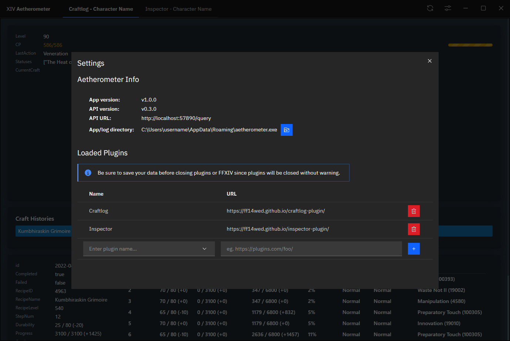

# Aetherometer

**Now updated for Endwalker**

Aetherometer is a framework that parses network data for FFXIV and presents
the parsed data stream through a GraphQL API that allows plugins to access
and display this information.

## Getting Started
[**Download for the latest release**](https://github.com/ff14wed/aetherometer/releases)

Download the zip file to a place with sufficient space on your system, and
extract it. Then run `aetherometer.exe`.

Then try out some [plugins](#plugins-list)!

> **Because Aetherometer fundamentally does not read memory, you should
  either start Aetherometer before starting any instance of FFXIV, or simply
  switch zones if you are already logged in. Otherwise, Aetherometer will not
  have a complete set of data from the game.**

If you're a developer interested in Aetherometer, see
[here](#for-developers).

## Features

Aetherometer is capable of supporting many different use cases, including
parsing live combat data for trigger or DPS logging purposes, display of
player and enemy movement on the map, crafting progress, etc.

While Aetherometer does not read memory to capture information from the game,
it is capable of retrieving extremely useful information just from reading
data from the network. This also has the advantage of potentially being
faster than the game itself can process the data.

## Plugins

Plugins are mini-applications that process data from a specific instance
of the game. They open as new "tabs" on the navigation drawer and you can
navigate between them without losing data on any other tab.

> Techincally plugins are able to process data from mulitple
  instances of the game, but Aetherometer's Stream handling abilities aim
  to reduce boilerplate Stream switching code.

### Plugins List

Here are some plugins that you can try to get an idea for Aetherometer's capabilities:
- Inspector Plugin - https://github.com/ff14wed/inspector-plugin
- Craftlog Plugin - https://github.com/ff14wed/craftlog-plugin

## Installing Plugins

1. Click on the Settings button in the top right of the window.
2. Enter in the plugin name and URL.
3. Click the "Add Plugin" button (plus sign).

### Removing Plugins / Closing Panes

If you want to close the page for a plugin, simply go back to the settings popup
and click the "Remove Plugin" button (trash can) next to the plugin you like to
remove.

## For Developers

### Creating plugins
See the [docs/plugin_work.md](docs/plugin_work.md) document.
### Contributing to Aetherometer

Aetherometer uses [Wails](https://wails.io/docs/gettingstarted/installation)
to build the project.

Once you have Wails installed, run `wails doctor` to ensure you have all
dependencies. Namely, Go 1.17+, Node 14+, and the WebView2 runtime.

To run in live development mode, be sure to have run `wails build` beforehand.
Then run `wails dev` to start the live development mode.

### Building

For a production build, use `wails build`.

### Plugin Development

Go to the documentation [here](docs/plugin_work.md).

### Testing

Currently, we use [Ginkgo](https://github.com/onsi/ginkgo) which is a neat BDD
framework for testing Golang.

To run all tests, simply run `ginkgo -r -p -race` (flags are recursive, in
parallel, turn on race detector).